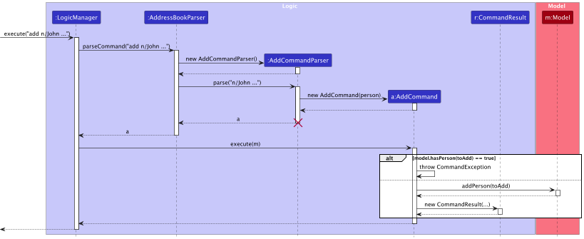
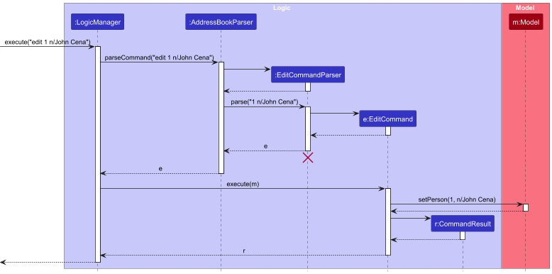
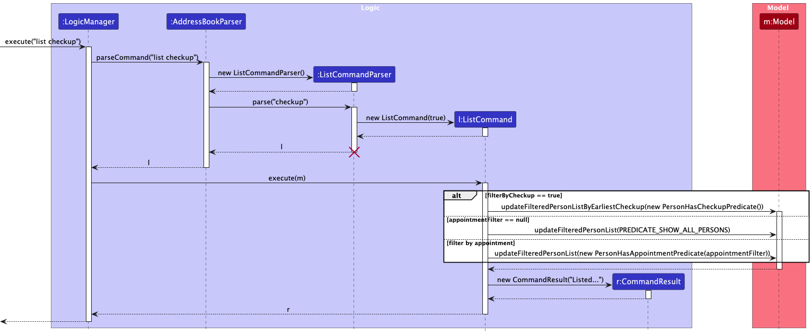
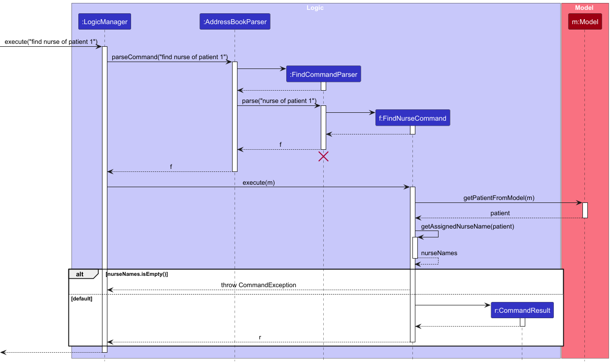
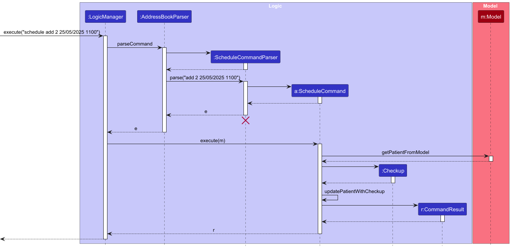

# MediBook Developer's Guide

## Table of Contents

1. [Acknowledgements](#acknowledgements)
1. [Settting up, getting started](#setting-up-getting-started)
1. [Design](#design)
   * [Architecture](#architecture)
   * [UI Component](#ui-component)
   * [Logic Component](#logic-component)
   * [Model Component](#model-component)
   * [Storage Component](#storage-component)
1. [Implementation](#implementation)
   * [Add](#add-feature)
   * [Edit](#edit-feature)
   * [List](#list-feature)
   * [Find](#find-feature)
   * [Assign](#assign-feature)
   * [Schedule](#schedule-feature)
1. [Documentation, logging, testing, configuration, dev-ops](#documentation-logging-testing-configuration-dev-ops)
1. [Appendix: Requirements](#appendix-requirements)
   * [Product Scope](#product-scope)
   * [User Stories](#user-stories)
   * [Use Cases](#use-cases)
   * [Non-Functional Requirements](#non-functional-requirements)
   * [Glossary](#glossary)
1. [Appendix: Instructions for manual testing](#appendix-instructions-for-manual-testing)
   * [Launch and Shutdown](#launch-and-shutdown)
   * [Deleting a Person](#deleting-a-person)
   * [Saving Data](#saving-data)

--------------------------------------------------------------------------------------------------------------------

## **Acknowledgements**

* [AB3](https://github.com/nus-cs2103-AY2425S2/tp) for being the base we build our project on.
* [JavaFX](https://openjfx.io/) for creating the Graphic User Interface of MediBook.
* [JUnit5](https://github.com/junit-team/junit5) for testing capability.

--------------------------------------------------------------------------------------------------------------------

## **Setting up, getting started**

Refer to the guide [_Setting up and getting started_](SettingUp.md).

--------------------------------------------------------------------------------------------------------------------

## **Design**

### Architecture

The ***Architecture Diagram*** given above explains the high-level design of the App.

Given below is a quick overview of main components and how they interact with each other.

**Main components of the architecture**

**`Main`** (consisting of classes [`Main`](https://github.com/se-edu/addressbook-level3/tree/master/src/main/java/seedu/address/Main.java) and [`MainApp`](https://github.com/se-edu/addressbook-level3/tree/master/src/main/java/seedu/address/MainApp.java)) is in charge of the app launch and shut down.
* At app launch, it initializes the other components in the correct sequence, and connects them up with each other.
* At shut down, it shuts down the other components and invokes cleanup methods where necessary.

The bulk of the app's work is done by the following four components:

* [**`UI`**](#ui-component): The UI of the App.
* [**`Logic`**](#logic-component): The command executor.
* [**`Model`**](#model-component): Holds the data of the App in memory.
* [**`Storage`**](#storage-component): Reads data from, and writes data to, the hard disk.

[**`Commons`**](#common-classes) represents a collection of classes used by multiple other components.

**How the architecture components interact with each other**

The *Sequence Diagram* below shows how the components interact with each other for the scenario where the user issues the command `delete 1`.

Each of the four main components (also shown in the diagram above),

* defines its *API* in an `interface` with the same name as the Component.
* implements its functionality using a concrete `{Component Name}Manager` class (which follows the corresponding API `interface` mentioned in the previous point.

For example, the `Logic` component defines its API in the `Logic.java` interface and implements its functionality using the `LogicManager.java` class which follows the `Logic` interface. Other components interact with a given component through its interface rather than the concrete class (reason: to prevent outside component's being coupled to the implementation of a component), as illustrated in the (partial) class diagram below.

The sections below give more details of each component.

### UI component

The **API** of this component is specified in [`Ui.java`](https://github.com/se-edu/addressbook-level3/tree/master/src/main/java/seedu/address/ui/Ui.java)

The UI consists of a `MainWindow` that is made up of parts e.g.`CommandBox`, `ResultDisplay`, `PersonListPanel`, `StatusBarFooter` etc. All these, including the `MainWindow`, inherit from the abstract `UiPart` class which captures the commonalities between classes that represent parts of the visible GUI.

The `UI` component uses the JavaFx UI framework. The layout of these UI parts are defined in matching `.fxml` files that are in the `src/main/resources/view` folder. For example, the layout of the [`MainWindow`](https://github.com/se-edu/addressbook-level3/tree/master/src/main/java/seedu/address/ui/MainWindow.java) is specified in [`MainWindow.fxml`](https://github.com/se-edu/addressbook-level3/tree/master/src/main/resources/view/MainWindow.fxml)

The `UI` component,

* executes user commands using the `Logic` component.
* listens for changes to `Model` data so that the UI can be updated with the modified data.
* keeps a reference to the `Logic` component, because the `UI` relies on the `Logic` to execute commands.
* depends on some classes in the `Model` component, as it displays `Person` object residing in the `Model`.

### Logic component

**API** : [`Logic.java`](https://github.com/se-edu/addressbook-level3/tree/master/src/main/java/seedu/address/logic/Logic.java)

Here's a (partial) class diagram of the `Logic` component:

The sequence diagram below illustrates the interactions within the `Logic` component, taking `execute("delete 1")` API call as an example.

**Note:** The lifeline for `DeleteCommandParser` should end at the destroy marker (X) but due to a limitation of PlantUML, the lifeline continues till the end of diagram.

How the `Logic` component works:

1. When `Logic` is called upon to execute a command, it is passed to an `AddressBookParser` object which in turn creates a parser that matches the command (e.g., `DeleteCommandParser`) and uses it to parse the command.
1. This results in a `Command` object (more precisely, an object of one of its subclasses e.g., `DeleteCommand`) which is executed by the `LogicManager`.
1. The command can communicate with the `Model` when it is executed (e.g. to delete a person). 
   Note that although this is shown as a single step in the diagram above (for simplicity), in the code it can take several interactions (between the command object and the `Model`) to achieve.
1. The result of the command execution is encapsulated as a `CommandResult` object which is returned back from `Logic`.

Here are the other classes in `Logic` (omitted from the class diagram above) that are used for parsing a user command:

How the parsing works:
* When called upon to parse a user command, the `AddressBookParser` class creates an `XYZCommandParser` (`XYZ` is a placeholder for the specific command name e.g., `AddCommandParser`) which uses the other classes shown above to parse the user command and create a `XYZCommand` object (e.g., `AddCommand`) which the `AddressBookParser` returns back as a `Command` object.
* All `XYZCommandParser` classes (e.g., `AddCommandParser`, `DeleteCommandParser`, ...) inherit from the `Parser` interface so that they can be treated similarly where possible e.g, during testing.

### Model component
**API** : [`Model.java`](https://github.com/se-edu/addressbook-level3/tree/master/src/main/java/seedu/address/model/Model.java)

The `Model` component,

* stores the address book data i.e., all `Person` objects (which are contained in a `UniquePersonList` object).
* stores the currently 'selected' `Person` objects (e.g., results of a search query) as a separate _filtered_ list which is exposed to outsiders as an unmodifiable `ObservableList<Person>` that can be 'observed' e.g. the UI can be bound to this list so that the UI automatically updates when the data in the list change.
* stores a `UserPref` object that represents the user’s preferences. This is exposed to the outside as a `ReadOnlyUserPref` objects.
* does not depend on any of the other three components (as the `Model` represents data entities of the domain, they should make sense on their own without depending on other components)

### Storage component

**API** : [`Storage.java`](https://github.com/se-edu/addressbook-level3/tree/master/src/main/java/seedu/address/storage/Storage.java)

The `Storage` component,
* can save both address book data and user preference data in JSON format, and read them back into corresponding objects.
* inherits from both `AddressBookStorage` and `UserPrefStorage`, which means it can be treated as either one (if only the functionality of only one is needed).
* depends on some classes in the `Model` component (because the `Storage` component's job is to save/retrieve objects that belong to the `Model`)

### Common classes

Classes used by multiple components are in the `seedu.address.commons` package.

--------------------------------------------------------------------------------------------------------------------

## **Implementation**

This section describes some noteworthy details on how certain features are implemented.

### Add Feature

The `add` command allows the user to add a new person to the address book.

1. `LogicManager` receives the command text and passes it to `AddressBookParser`.
1. `AddressBookParser` parses the command and returns an `AddCommand` object.
1. `AddCommand#execute()` adds the person to the model and returns a `CommandResult`.

#### Design considerations:

We chose to implement parsing with a `ParserUtil` helper class to simplify each command parser. An alternative would be using a central parser for all commands, but this was less modular.

### Edit Feature

The `edit` command allows the user to edit an existing person in the address book.

1. `LogicManager` receives the command text and passes it to `AddressBookParser`.
1. `AddressBookParser` parses the command and returns an `EditCommandParser` object.
1. `EditCommandParser#parse()` creates an `EditCommand` object.
1. `EditCommand#execute()` edits the person in the model and returns a `CommandResult`.

#### Design considerations:

We chose to implement parsing with a `ParserUtil` helper class to simplify each command parser. An alternative would be using a central parser for all commands, but this was less modular.

### List Feature

The `list` command allows users to display a subset of people in the address book based on optional filters.

It supports the following use cases:
* `list` — Lists **all persons** in the address book (patients and nurses).
* `list nurse` or `list patient` — Lists **only nurses** or **only patients**, respectively.
* `list checkup` — Lists all patients with scheduled **checkups**, sorted by earliest checkup date.

#### Execution Flow:
1. `LogicManager` receives the command text (e.g., `"list checkup"`) and passes it to `AddressBookParser`.
1. `AddressBookParser` parses the command and returns an `ListCommandParser` object.
1. `ListCommandParser#parse()` constructs a `ListCommand` object, based on the input string.
1. `ListCommand#execute()` evaluates the internal flags:
   * If the command was `list checkup`, it calls `updateFilteredPersonListByEarliestCheckup(...)` with a `PersonHasCheckupPredicate`.
   * If no filter was provided, it lists all persons using `Model.PREDICATE_SHOW_ALL_PERSONS`.
   * If a specific appointment filter was provided (e.g., `"nurse"`), it filters with `PersonHasAppointmentPredicate`.
1. A `CommandResult` is returned with a success message indicating what was listed.

#### Design considerations:

We chose to centralize filtering logic inside `ListCommand`, separating parsing (`ListCommandParser`) from behavior. This approach improves maintainability and makes it easy to extend filtering options (e.g., by tag or medical history) in the future.

### Find Feature

The `find` command enables users to search for specific entities in the address book, including:
* Nurses assigned to the patients.
* Patients associated with the nurses.
* Users whose names contain the specified search terms.

This functionality improves user experience by allowing quick access to relevant information.

#### Execution Flow:
1. `LogicManager` receives the command text (e.g. `find nurse of patient 8`) from the user and passes it to `AddressBookParser`.
1. `AddressBookParser` parses the command and returns a `FindCommandParser` object.
1. Depending on the arguments, `FindCommandParser#parse()` will return one of the following:
   * `FindNurseCommand`: for searching nurses assigned to a specific patient.
   * `FindPatientCommand`: for searching patients assigned to a specific nurse.
   * `FindCommand`: a general command for searching based on keywords in contacts' names.
1. `FindCommand#execute()` retrieves the relevant entries from the model and returns a `CommandResult`.
1. For `FindNurseCommand`, it finds and returns all nurses assigned to the specified patient.
1. For `FindPatientCommand`, it finds and returns all patients assigned to the specified nurse.
1. For `FindCommand`, it allows the user to search by keywords. For example, executing `find tom harry` will return all users that contain either "tom" or "harry" in their names.

Using this command, users can effortlessly navigate and manage their address book, finding relevant information quickly and efficiently.

#### Design considerations:

We chose to implement parsing with a `ParserUtil` helper class to simplify each command parser. An alternative would be using a central parser for all commands, but this was less modular.

### Assign Feature

The `assign` command allows the user to assign a nurse to a patient.

#### Execution Flow:

1. `LogicManager` receives the command text and passes it to `AddressBookParser`.
1. `AddressBookParser` parses the command and returns an `AssignCommand` object.
1. `AssignCommand#execute()` assigns the nurse to the patient and returns a `CommandResult`.

#### Design considerations:

We chose to implement parsing with a `ParserUtil` helper class to simplify each command parser. An alternative would be using a central parser for all commands, but this was less modular.

### Schedule Feature

The `schedule` command allows the user to create a checkup between a patient and a nurse.

#### Execution Flow:

1. `LogicManager` receives the command text and passes it to `AddressBookParser`.
1. `AddressBookParser` parses the command and returns an `ScheduleCommand` object.
1. `ScheduleCommand#execute()` creates or deletes the checkup from the patient and returns a `CommandResult`.

#### Design considerations:

We chose to implement parsing with a `ParserUtil` helper class to simplify each command parser. An alternative would be using a central parser for all commands, but this was less modular.

--------------------------------------------------------------------------------------------------------------------

## **Documentation, logging, testing, configuration, dev-ops**

* [Documentation guide](Documentation.md)
* [Testing guide](Testing.md)
* [Logging guide](Logging.md)
* [Configuration guide](Configuration.md)
* [DevOps guide](DevOps.md)

--------------------------------------------------------------------------------------------------------------------

## **Appendix: Requirements**

### Product scope

**Target user profile**:

* Manager or nurse at a private nurse agency
* has a need to manage a significant number of nurses and/or patients
* prefer desktop apps over other types
* can type fast
* prefers typing to mouse interactions
* is reasonably comfortable using CLI apps

**Value proposition**:
1. Manage nurse and patients faster than a typical mouse/GUI driven app
1. Allows faster creation and storage of details compared to traditional pen and paper methods
1. Enables easy transfer and tracking of patients compared to current system where it is inefficient to do so
1. Saves time from having to log into centralised system from healthcare system in Singapore each time data is needed.

### User stories

Priorities: High (must have) - `* * *`, Medium (nice to have) - `* *`, Low (unlikely to have) - `*`

| Priority | As a …​                       | I want to …​                                                                         | So that I can…​                                                                                 |
|----------|-------------------------------|--------------------------------------------------------------------------------------|-------------------------------------------------------------------------------------------------|
| `* * *`  | Manager                       | add nurse contacts                                                                   | add new nurses contacts who joined the team                                                     |
| `* * *`  | Manager                       | delete nurse contacts                                                                | remove contact of nurses who leave the agency                                                   |
| `* * *`  | Manager                       | add patients contacts                                                                | keep track of new patients who register with the agency                                         |
| `* * *`  | Manager                       | delete patient contacts                                                              | remove patients who are no longer registered with the agency                                    |
| `* * *`  | Manager                       | view all nurses                                                                      | see all nurses details at once                                                                  |
| `* * *`  | Manager                       | view all patients                                                                    | see all registered patients at once                                                             |
| `* * *`  | Nurse                         | view patients details                                                                | view the needs of the patient I'm caring for                                                    |
| `* * *`  | Nurse                         | exit the application quickly                                                         | resume other tasking at hands                                                                   |
| `* *`    | Manager                       | view all patients attached to a certain nurse                                        | check which patients a nurse is currently assigned to                                           |
| `* *`    | Manager                       | view the nurse assigned to a patient                                                 | check who is in charge of a certain patient                                                     |
| `* *`    | Manager                       | schedule appointments for a patient                                                  | ensure the patient has an appointment and a nurse                                               |
| `* *`    | Manager                       | assign a nurse to a patient                                                          | ensure the patient has a specified nurse                                                        |
| `* *`    | Manager                       | sort patient details                                                                 | sort my patients according to various criteria such as blood type and severity level            |
| `* *`    | Manager                       | assign categories to patients                                                        | add the severity of each patient                                                                |
| `* *`    | Manager                       | adjust categories of patients                                                        | lower or increase the severity / priority of patients over time                                 |
| `* *`    | Nurse                         | find patient details                                                                 | check details about a specific nurse                                                            |
| `* *`    | Nurse                         | sort patient details                                                                 | quickly find details about a specific patient                                                   |
| `* *`    | Nurse                         | transfer the patients under me to another nurse                                      | ensure my patients are not neglected during my absence                                          |
| `*`      | Manager                       | add roles of nurses                                                                  | see which nurse has a larger responsibility                                                     |
| `*`      | Forgetful Nurse               | schedule automatic reminders for task like checkups and medications times            | task are always done on time                                                                    |
| `*`      | Nurse during a midnight shift | activate night mode interface with darker colours and larger text to enhance visuals | reduce eye strain while ensuring accuracy when recording patient data in dimly lit environments |
| `*`      | Manager                       | log in using my staff credential                                                     | Securely access patient records                                                                 |

### Use cases

(For all use cases below, the **System** is the `MediBook` and the **Actor** is the `user`, unless specified otherwise)

**Use case 1: Delete a nurse / patient**

**MSS**

1.  User requests to list nurses / patients
1.  AddressBook shows the list of nurses / patients
1.  User requests to delete a specific nurse / patient in the list
1.  AddressBook deletes the nurse / patient

    Use case ends.

**Extensions**

* 2a. The list is empty.

  Use case ends.

* 3a. The given index is invalid.

    * 3a1. AddressBook shows an error message.

      Use case resumes at step 2.

**Use case 2: Add a nurse / patient**

**MSS**

1.  User requests to list nurses / patients
1.  AddressBook shows the list of nurses / patients
1.  User requests to add a nurse / patient in the list
1.  AddressBook adds the nurse / patient

    Use case ends.

**Extensions**

* 2a. The list is empty.

    Use case ends.

* 3a. The user enters incorrect command format.

    * 3a1. AddressBook shows an error message.

      Use case resumes at step 2.

**Use case 3: Edit a nurse / patient**

**MSS**

1. User requests to list nurses / patients
1. AddressBook shows the list of nurses / patients
1. User requests to edit a nurse's / patient's details
1. AddressBook edits the nurse's / patient's details

    Use case ends.

**Extensions**

* 2a. The list is empty.

    Use case ends.

* 3a. The user enters incorrect command format.

    * 3a1. AddressBook shows an error message.

      Use case resumes at step 2.

**Use case 4: Exit the app**

**MSS**

1. User requests to exit app
1. AddressBook closes

    Use case ends.

**Extensions**

* 1a. The user enters incorrect command format.
    * 1a1. AddressBook shows an error message.

      Use case resumes at step 1.

### Non-Functional Requirements

1.  Should work on any _mainstream OS_ as long as it has Java `17` or above installed.
1.  Should be able to hold up to 1000 persons without a noticeable sluggishness in performance for typical usage.
1.  A user with above average typing speed for regular English text (i.e. not code, not system admin commands) should be able to accomplish most of the tasks faster using commands than using the mouse.

### Glossary

* **Patient Contact**: Refers to the information stored about a patient in the system (e.g: Name, Phone number, Email, Address, Appointment, Blood Type, next-of-kin))
* **Appointment**: The role of the person
* **Manager**: Manages the nurses
* **Nurse**: Tends to the patients
* **Checkup**: A scheduled appointment for nurse to visit and treat the patient.

### Requirements implemented ###

### Requirements yet to be implemented ###

--------------------------------------------------------------------------------------------------------------------

## **Appendix: Instructions for manual testing**

Given below are instructions to test the app manually.

**Note:** These instructions only provide a starting point for testers to work on;
testers are expected to do more *exploratory* testing.

### Launch and shutdown

1. Initial launch

   1. Download the jar file and copy into an empty folder

   1. Double-click the jar file Expected: Shows the GUI with a set of sample contacts. The window size may not be optimum.

1. Saving window preferences

   1. Resize the window to an optimum size. Move the window to a different location. Close the window.

   1. Re-launch the app by double-clicking the jar file. 
       Expected: The most recent window size and location is retained.

1. Shutdown
   1. Type exit into the app CLI 
      Expected: The MediBook application closes.

### Deleting a person

1. Deleting a person while all persons are being shown

   1. Prerequisites: List all persons using the `list` command. Multiple persons in the list.

   1. Test case: `delete 1` 
      Expected: First contact is deleted from the list. Details of the deleted contact shown in the status message. Timestamp in the status bar is updated.

   1. Test case: `delete 0` 
      Expected: No person is deleted. Error details shown in the status message. Status bar remains the same.

   1. Other incorrect delete commands to try: `delete`, `delete x`, `...` (where x is larger than the list size) 
      Expected: Similar to previous.

### Adding a person
1. Adding a person while all persons are being shown
   1. Prerequisites: List all persons using the `list` command. Multiple persons in the list.
   1. Test case: `add n/John Doe dob/01/01/2001 p/98765432 e/johnd@example.com a/311, Clementi Ave 2, #02-25 b/AB+ ap/Patient nok/Jane 91234567 t/newcomer mh/Diabetes mh/High Blood Pressure`  
   Expected: A new contact is created and the displayed person list is updated.
1. Adding a person using only compulsory fields
   1. Test case: `add n/John Sim dob/01/01/2025 p/98765432 a/123 Block 7 b/AB+ ap/patient`  
    Expected: Creates a new patient contact with the minimum fields included.
1. Adding a duplicate person `add n/John Sim dob/01/01/2025 p/98765432 a/123 Block 7 b/AB+ ap/patient`  
   Expected: No person is created. Error message shows "This person already exists in the address book"
1. Other incorrect commands to try: 
   1. Invalid names: names containing non-alphabetical symbols
   1. Invalid number: Less than 3 digits or non integer inputs
   1. Invalid Date of Birth: Non integer and non slash inputs, incorrect date format (DD/MM/YYYY)
   1. Invalid Blood type: Not matching any of the 8 specified blood types.
   1. Invalid Appointment: Not matching patient or nurse, non-alphabetical inputs

### Editing a Person
1. Editing any field of a person currently being displayed
    1. Prerequisites: List all persons using the `list` command. Multiple persons in the list.
    1. Test case: `edit 2 n/Samantha` 
       Expected: Changed the name of the person at index 2 of the displayed list to Samantha.
    1. Test case: Other fields to be edited:
       1. tags: `edit 1 t/discharge t/No family`  
          Expected: Removes all tags of the person at index 1 and creates 2 tags for that person.
       1. Medical History
            1. Command: `edit 1 mh/Diabetes` 
                Expected: Removes the medical history of the patient at index 1 and creates a new medical history containing diabetes. If the person is a nurse, an error will occur as medical history should not be added to a nurse.
            1. Command: `edit 1 mh/` 
                Expected: Clears the medical history of the person.
       1. Appointment `edit 1 ap/nurse`
            1. Patients contacts can be converted to Nurse appointment if it does not contain any medical history
            1. Expected: Changes the patients appointment to a nurse if there is no medical history. Returns an error if the patient does have medical history.

### Listing persons
1. Listing all people, people based on appointments (nurse or patient), or based on checkups scheduled
   1. Prerequisites: List all persons using the `list` command. Multiple persons in the list.
   2. Test case: `list` 
      Expected: Displays all contacts (nurses and patients).
   2. Test case: `list patient` 
      Expected: Displays all patients.
   3. Test case: `list nurse` 
      Expected: Displays all nurses.
   4. Test case: `list checkup` 
      Expected: Displays all patients with checkups scheduled, sorted from earliest to latest.

### Finding persons
1. Finding people by name or part of name
   1. Prerequisites: List all persons using the `list` command. Multiple persons in the list.
   2. Test case: `find <first name>` 
      Expected: Displays contacts whose names contain `<first name>` in any part of their name.
   3. Test case: `find <part of name>` 
      Expected: Displays contacts whose names contain `<part of name>` in any part of their name.
2. Finding nurse(s) assigned to a patient
   1. Prerequisites: List all persons using the `list` command. Multiple persons in the list.
   2. Test case: `find nurse of patient PATIENT_INDEX` 
      Expected: Displays nurse(s) assigned to patient at `PATIENT_INDEX`
3. Finding patient(s) who have a specified nurse assigned to them

### Assigning a nurse to a patient
1. Assigning a nurse to a patient by their index numbers
   1. Prerequisites: List all persons using the `list` command. Multiple persons in the list (nurses and patients).
   2. Test case: `assign PATIENT_INDEX NURSE_INDEX` 
      Expected: Nurse at `NURSE_INDEX` gets assigned to patient at `PATIENT_INDEX`.
   3. Test case: `assign` 
      Expected: Shows an invalid command format error message with usage instructions.
   4. Other incorrect commands to try:
      1. Missing an argument: no `NURSE_INDEX` specified
      2. Invalid index: using non-numeric characters for index values

### Removing nurse assignment from a patient
1. Removing the assignment of a nurse from a patient
   1. Prerequisites: List all persons using the `list` command. Multiple persons in the list. Patients with assigned nurses exist.
   2. Test case: `assign delete NURSE_NAME PATIENT_INDEX` 
      Expected: Removes the assigned nurse with name `NURSE_NAME` from the patient at `PATIENT_INDEX`.
   3. Test case: `assign delete` 
      Expected: Shows an invalid command format error message with usage instructions.
   4. Other incorrect commands to try:
      1. Missing an argument: no `NURSE_NAME` or `PATIENT_INDEX` specified
      2. Invalid index: using non-numeric characters for the index value

### Schedule checkups

### Viewing nurses / patients
1. Viewing nurse or patient details
   1. Prerequisites: List all persons using the `list` command. Multiple persons in the list.
   2. Test case: `view INDEX` 
      Expected: Displays details for the contact at `INDEX`. If this contact is a patient and has medical history details, the medical history will be listed.
   3. Test case: `view` 
      Expected: Shows an invalid command format error message with usage instructions.
   4. Other incorrect commands to try:
      1. Missing index value
      2. Invalid index: using non-numeric characters for the index value
      3. Too many arguments: entering multiple index values

### Saving data

1. Dealing with missing/corrupted data files

   1. Simulate a corrupted file by editing the saved .json file such that is is no longer in json format. This should result in a empty screen upon start up.
   1. Delete the file and restart the app to recover and start with a small list of sample contacts.

## **Appendix: Effort**

## **Appendix: Planned Enhancements**

These are some features / improvements our team has planned to implement in the future due to lack of time.
1. Assigning severity to patients
2. Adjusting the severity of patients
3. Allow sorting of the list to more filters e.g. Severity or age
4. Allow reminders for checkups or missing assigned nurse
5. Support for Dark mode
6. Ability to adjust working hours for scheduling checkups or disable the working hours feature completely.
