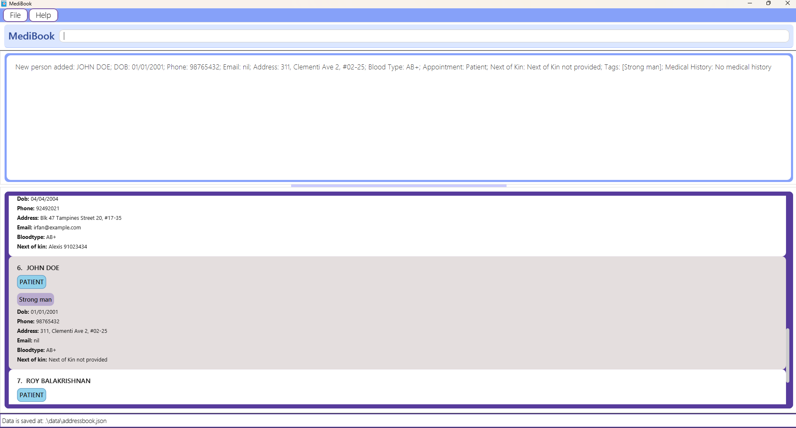
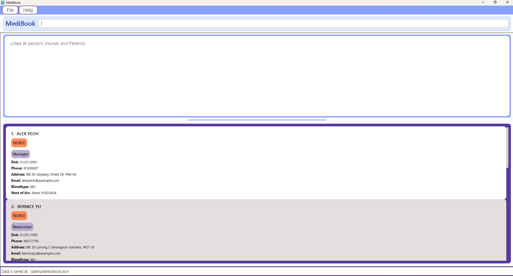
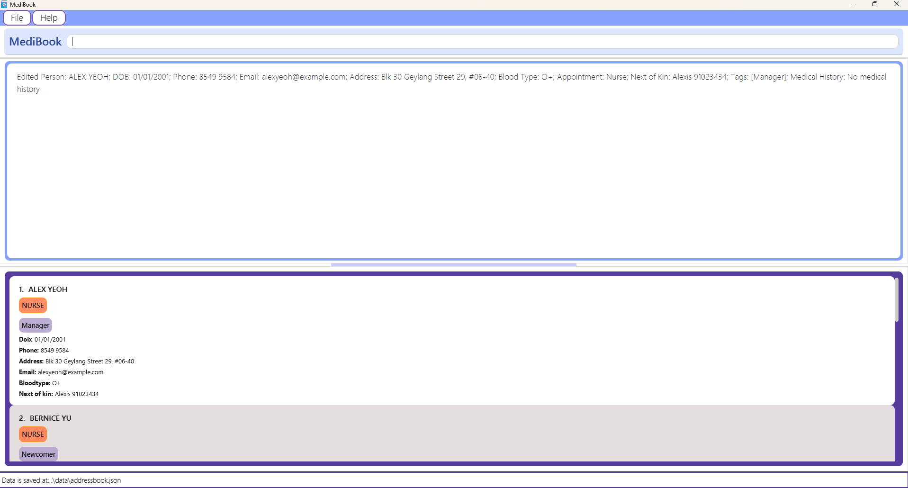
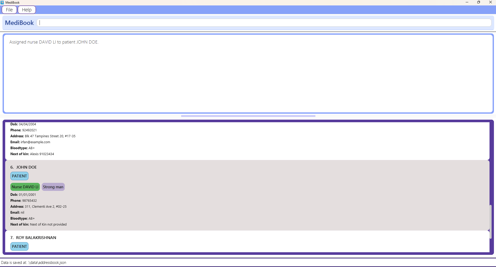
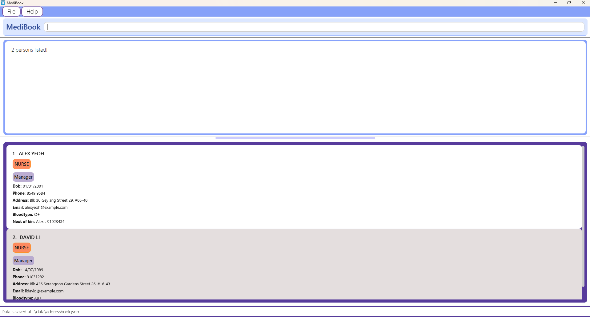
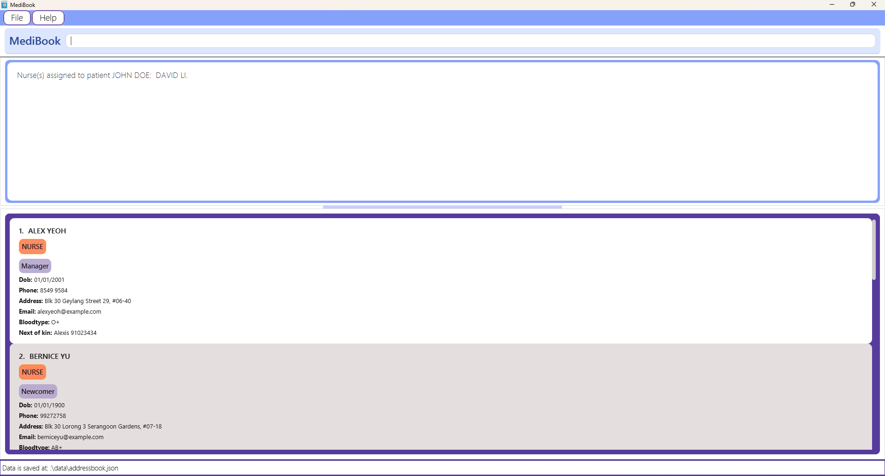
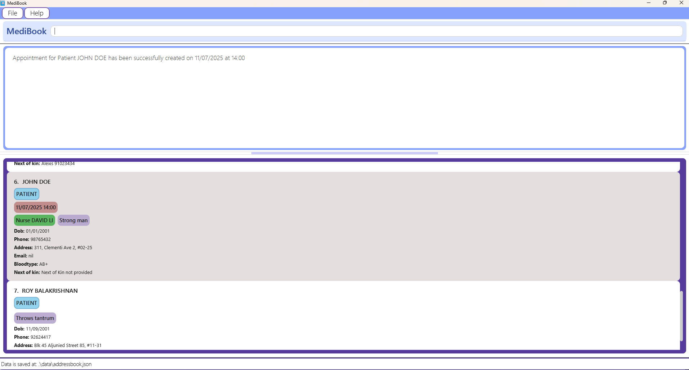
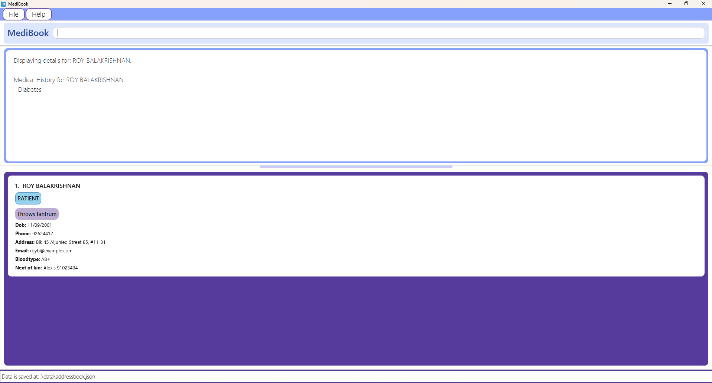

## About Medibook

MediBook is a **desktop app for private nurse center managers, to manage patient and nurse records, optimized for use via a Command Line Interface (CLI)**, while still offering the benefits of a Graphical User Interface (GUI).

Designed for speed and efficiency, **MediBook** empowers private nurse centres to:
- Assign nurses to patients
- Retrieve patient and nurse information
- Manage checkup sessions and medical history of patients

All within a user-friendly interface that is faster than traditional pen-and-paper or GUI-based systems. Get ready to revolutionize your private nurse centre management with **MediBook**, by getting started on a quick [Installation Guide](#installation-guide) and exploring the [Features](#features) of the app below!

## Using this User Guide

This user guide is designed to help you get started with **MediBook**, and to provide a simple and concise reference if you need any help while using the app. You may click on the words in blue to jump directly to the relevant section of the user guide.

To get an overview of the guide, you can refer to the [Table of contents](#table-of-contents) below.

<div style="page-break-after: always;"></div>

## Table of Contents

1. [About Medibook](#about-medibook)
2. [Using this user guide](#using-this-user-guide)
3. [Table of contents](#table-of-contents)
4. [Installation guide](#installation-guide)
5. [Overview of person attributes](#overview-of-person-attributes)
6. [Features](#features)
    * [Viewing Help](#viewing-help--help) : `help`
    * [Adding a person](#adding-a-person--add) : `add`
    * [Listing persons](#listing-persons--list) : `list`
    * [Editing a person](#editing-a-person--edit) : `edit`
    * [Assign a nurse to a patient](#assign-a-nurse-to-a-patient--assign) : `assign`
    * [Delete nurse assignment from a patient](#deleting-a-person--delete) : `assign delete`
    * [Locating persons](#locating-persons--find) : `find`
    * [Finding patient](#finding-patient--find-patient-of-nurse-) : `find patient of nurse`
    * [Finding nurse](#finding-nurse--find-nurse-of-patient) : `find nurse of patient`
    * [Schedule checkups](#schedule-checkups--schedule-add-for-patient--schedule-delete-for-patient) : `schedule add for patient` / `schedule delete for patient`
    * [Viewing a nurse or patient](#viewing-a-nurse-or-patient--view) : `view`
    * [Deleting a person](#deleting-a-person--delete) : `delete`
    * [Clearing all entries](#clearing-all-entries--clear) : `clear`
    * [Exiting the program](#exiting-the-program--exit) : `exit`
7. [Saving the data](#saving-the-data)
8. [Editing the data file](#editing-the-data-file)
9. [FAQ](#faq)
10. [Known Issues](#known-issues)
11. [Command Summary](#command-summary)
12. [Duplicate Policy](#duplicate-policy)
13. [Colour Legend](#colour-legend)

--------------------------------------------------------------------------------------------------------------------


<div style="page-break-after: always;"></div>

## Installation Guide

1. Ensure you have Java `17` or above installed in your Computer.<br>
   * Steps to check your current Java version, click [here](#faq).
   * Steps to install Java in your computer, click [here](https://se-education.org/guides/tutorials/javaInstallation.html).
   * **For Mac users:** Ensure you have the precise Java version prescribed [here](https://se-education.org/guides/tutorials/javaInstallationMac.html).

> 🧠 **Why do I have to install Java?**
> - Java is a versatile programming language that lets apps run on any device with a Java Virtual Machine (JVM). Once installed, you can run any Java app, including MediBook. You can find out more about Java [here](https://dev.java/learn/getting-started/).

2. Download the latest `.jar` file from [here](https://github.com/AY2425S2-CS2103T-T13-2/tp/releases).
   - [What is a JAR file?](https://docs.oracle.com/javase/8/docs/technotes/guides/jar/jarGuide.html)

3. Copy the file to an empty folder you want to use as the _home folder_ for MediBook.
   - MediBook will create a data folder in this _home folder_ to store your [data files](#saving-the-data).

4. Open a [command terminal](#faq), run the following commands:<br>
   ```
   cd home_folder
   java -jar MediBook.jar
   ```
   Example: if your `MediBook.jar` is in the folder `C:/Users/user/Documents`,
   Run the commands:
   ```
   cd C:/Users/user/Documents
   java -jar MediBook.jar
   ```

   A GUI similar to the below should appear in a few seconds. Note how the app contains some sample data.<br>

   
<span style="display: block; text-align: center; margin: 0;">MediBook Start-Up Graphical User Interface</span>


5. Type the command in the command box and press Enter to execute it. e.g. typing **`help`** and pressing Enter will open the help window.<br>
   Some example commands you can try:

   * `list` : Lists all contacts.

   * `add n/John Doe dob/01/01/2001 p/98765432 e/johnd@example.com a/311, Clementi Ave 2, #02-25 b/AB+ ap/Patient nok/Jane 91234567 t/Big Boy mh/High Blood Pressure` : Adds a contact named `John Doe` to MediBook.

   * `edit 2 b/O+` : Edits the blood type of the 2nd contact shown in the current list to O+.

   * `delete 3` : Deletes the 3rd contact shown in the current list.

   * `assign 1 2`: Assigns the patient at index 1 to the nurse at index 2 shown in the current list.

   * `assign delete john doe 3` : Removes assigned nurse John Doe from the patient at index 3.

   * `find j` : Finds all contacts whose names start contains the letter 'j'.

   * `find patient of nurse 1` : Finds the patients assigned to the nurse at index 1 of the currently shown list.

   * `find nurse of patient 2` : Finds the nurses assigned to the patient at index 2 on the currently shown list.

   * `schedule add for patient 2 25/05/2025 1100` : Schedules a check-up for the patient shown at the 2nd index of the currently shown list at the given date and time.

   * `schedule delete for patient 2 25/05/2025 1100` : Deletes a check-up for the patient shown at the 2nd index of the list at the given date and time.

   * `view 4` : Displays the medical history of the person at the index 4 in the current list. If the person is a patient with medical history, the medical history will also be shown.

   * `clear` : Deletes all contacts.

   * `exit` : Exits the app.

6. Refer to the [Features](#features) below for details of each command.

[🔝 Back to Table of Contents](#table-of-contents)

--------------------------------------------------------------------------------------------------------------------
<div style="page-break-after: always;"></div>

## Overview of Person Attributes

This section provides an overview of all the attributes a person in MediBook can have, including whether they're required, what format they should follow, and any special notes.

| **Attribute**    | **Prefix** | **Required?** | **Valid Format**                                                                                                                                                                                                                                                       | **Example**                            |
|------------------|------------|---------------|------------------------------------------------------------------------------------------------------------------------------------------------------------------------------------------------------------------------------------------------------------------------|----------------------------------------|
| Name             | `n/`       | ✅ Yes         | - Alphabetical<br/>- **Non consecutive** special characters (hyphens, slash, apostrophes)<br/>- Spaces<br/>- Cannot start or end with a special character<br/>- Case-insensitive                                                                                       | E.g., `Joh'n-S/O-Doe`                  |
| Date of Birth    | `dob/`     | ✅ Yes         | `dd/mm/yyyy`                                                                                                                                                                                                                                                           | E.g., `11/11/2003`                     |
| Phone Number     | `p/`       | ✅ Yes         | - Max allowable is 17 digits<br/>- Spaces are allowed, but each group requires min 3 digits <br/>- Only numericals and spaces are allowed, no other symbols are allowed                                                                                                | E.g., `1234 567 890`                   |
| Address          | `a/`       | ✅ Yes         | -  Free text<br/>- Case-sensitive                                                                                                                                                                                                                                      | E.g., `10 NUS Road, #03-21`            |
| Blood Type       | `b/`       | ✅ Yes         | - Standard blood group types <br/>- Case-insensitive                                                                                                                                                                                                                   | E.g., `A+`, `AB-`, etc.                |
| Appointment Type | `ap/`      | ✅ Yes         | - Appointment type of personnel <br/>- Case-insensitive                                                                                                                                                                                                                | E.g., `Nurse` or `Patient`             |
| Email            | `e/`       | ❌ Optional    | - `local-part@domain.com` <br/>- Local-part (min 2 characters) with special characters (plus, underscore, dot, hyphen) <br/>- Local-part must start with alphanumeric character <br/>- Domain (min 1 character) <br/>- `com` can be replaced with minimum 2 characters | E.g., `john@example.com`               |
| Next of Kin      | `nok/`     | ❌ Optional    | - `Name Phone` <br/>- A space is required between `Name` and `Phone` <br/>- `Name` Same format constraints as the name attribute above <br/>- `Phone` Same format constraints as the phone number attribute above <br/>- Only one Next of Kin allowed                  | E.g., `Jane 91234567`                  |
| Tags             | `t/`       | ❌ Optional    | - Only alphanumeric and spaces allowed <br/>- Case-sensitive <br/>- Multiple tags allowed <br/>- [Colour based](#Colour-Legend)                                                                                                                                        | E.g., `2 Smart`                        |
| Medical History  | `m/`       | ❌ Optional*   | - Alphanumerical and spaces <br/>- Special characters (commas, hyphens, slash, rounded brackets, colon)<br/>- Only allowed for **patients** <br/>- Multiple medical histories allowed                                                                                  | E.g., `(Very, sick): - urgent/needy12` |
| Checkups         | *(N/A)*    | ❌ Optional    | Managed via `schedule` command <br/>- Each checkup is fixed 30 minutes <br/>- Checkups cannot be scheduled in the past.                                                                                                                                                | Not included in `add` command          |

> ⚠️ **Note:** Optional fields are marked with square brackets in command formats for readability. **Do not include square brackets in your actual command input.**
> ✅ Correct: `e/john@example.com`
> ❌ Incorrect: `[e/john@example.com]`

> ⚠️ **Email Constraints:** The email format given [above](#overview-of-person-attributes) is a simplified version, for tidiness, you can find the 
> full constraints, through a warning message, when you enter an invalid email in the app.

 [🔝 Back to Table of Contents](#table-of-contents)

--------------------------------------------------------------------------------------------------------------------
<div style="page-break-after: always;"></div>

## Features

<div markdown="block" class="alert alert-info">

**Notes about the command format:**<br>

* Words in `UPPER_CASE` are the parameters to be supplied by the user.<br>
  e.g. in `add n/NAME`, `NAME` is a parameter which can be used as `add n/John Doe`.

* Items in square brackets are optional — do not include the brackets themselves when typing commands.<br>
  e.g. `n/NAME [t/TAG]` can be used as `n/John Doe t/friend` or as `n/John Doe`.

* Items with `…`​ after them can be used multiple times including zero times.<br>
  e.g. `[t/TAG]…​` can be used as ` ` (i.e. 0 times), `t/friend`, `t/friend t/family` etc.

* Parameters can be in any order.<br>
  e.g. if the command specifies `n/NAME p/PHONE_NUMBER`, `p/PHONE_NUMBER n/NAME` is also acceptable.

* Extraneous parameters for commands that do not take in parameters (such as `help`, `exit` and `clear`) will be ignored.<br>
  e.g. if the command specifies `help 123`, it will be interpreted as `help`.

* If you are using a PDF version of this document, be careful when copying and pasting commands that span multiple lines as space characters surrounding line-breaks may be omitted when copied over to the application.
</div>

Quick Navigation: 
[Viewing Help](#viewing-help--help) •
[Adding a person](#adding-a-person--add) •
[Listing all persons](#listing-persons--list) •
[Editing a person](#editing-a-person--edit) •
[Locating by name](#locating-persons--find) •
[Finding patients](#finding-patient--find-patient-of-nurse-) •
[Finding nurse](#finding-nurse--find-nurse-of-patient) •
[Deleting](#deleting-a-person--delete) •
[Clearing all entries](#clearing-all-entries--clear) •
[Exiting program](#exiting-the-program--exit) •
[Assigning nurse](#assign-a-nurse-to-a-patient--assign) •
[Delete nurse assignment](#delete-nurse-assignment-from-a-patient--assign-delete) •
[Schedule checkups](#schedule-checkups--schedule-add-for-patient--schedule-delete-for-patient) •
[Viewing person](#viewing-a-nurse-or-patient--view) •
[Saving data](#saving-the-data) •
[Editing data file](#editing-the-data-file)

### Viewing help : `help`

Launches a popup window with a link for our User Guide. Clicking on `Copy URL` will copy the URL for you to paste 
in your browser.


<span style="display: block; text-align: center; margin: 0;">`Help` Pop-up Window</span>

Format: `help`

[🔙 Back to Features](#features)

### Adding a person : `add`

Adds a person to the address book.

#### Details

* A person can have any number of tags and medical history (including 0)
* Medical history is only for patients, an error will occur if you try to add a nurse with medical history.

#### Format

`add n/NAME dob/DOB p/PHONE_NUMBER a/ADDRESS b/BLOOD_TYPE ap/APPOINTMENT [e/EMAIL] [nok/NEXT_OF_KIN_NAME_PHONE] [t/TAG]…​ [mh/MEDICAL_HISTORY]…​`


#### Examples

* `add n/John Doe dob/01/01/2001 p/98765432 a/311, Clementi Ave 2, #02-25 b/AB+ ap/Patient t/Strong man`
* `add n/Betsy Crowe dob/01/01/2001 t/friend e/betsycrowe@example.com a/Newgate Prison p/1234567 t/No Family mh/Insane, but not dangerous b/B+ ap/Patient`

>💡**Tip**: You can refer back to [here](#overview-of-person-attributes), for more details on the person attributes and their formats.

> ⚠️ **Constraints:** MediBook has a duplicate policy which you can view [here](#duplicate-policy).


<span style="display: block; text-align: center; margin: 0;">`add n/John Doe dob/01/01/2001 p/98765432 a/311, Clementi Ave 2, #02-25 b/AB+ ap/Patient t/Strong man` Command Execution</span>

[🔙 Back to Features](#features)
[📋 View Person Attributes](#overview-of-person-attributes)

### Listing persons : `list`

Displays a list of persons in the address book. You can choose to list all persons, only patients, only nurses or all patients with checkups.

#### Formats 

* `list`: Lists all persons.
* `list patient`: Lists only patients.
* `list nurse`: Lists only nurses.
* `list checkup`: Lists all patients with checkups.

#### Examples

* `list`: Shows every entry in the address book.
* `list patient`: Shows only persons with the appointment role `Patient`.
* `list nurse`: Shows only persons with the appointment role `Nurse`.
* `list checkup`: Shows only the patients with scheduled checkups, sorted from earliest to latest checkup.


<span style="display: block; text-align: center; margin: 0;">`list` Command Execution</span>

[🔙 Back to Features](#features)

### Editing a person : `edit`

Edits an existing person's information in MediBook.

#### Details

* Edits the person at the specified `INDEX`. The index refers to the index number shown in the displayed person list. The index **must be a positive integer** 1, 2, 3,…​
* At least one of the optional fields must be provided.
* Existing values will be updated to the input values.
* When editing tags or medical history, the existing tags or medical history of the person will be removed i.e. tags or medical history is not cumulative.
* You can remove all the person’s tags by typing `t/` without specifying any tags after it.
* You can remove all the person’s medical history by typing `mh/` without specifying any medical history after it.
* Editing of medical history is only for patients, an error will occur if you try to add by editing in a medical history to a nurse.
* If a change of appointment is required, patient to nurse, do ensure medical history is cleared before changing appointment.
* If a change of appointment is required, nurse to patient, do ensure the nurse has no patients assigned to them before changing appointment.
* If a change of nurse name is required, do ensure the nurse has no patients assigned to them before changing name.

#### Format

`edit INDEX [n/NAME] [dob/DOB] [p/PHONE] [e/EMAIL] [a/ADDRESS] [b/BLOOD_TYPE] [ap/APPOINTMENT] [nok/NEXT_OF_KIN_NAME_PHONE] [t/TAG]…​ [mh/MEDICAL_HISTORY]…​`

#### Examples

*  `edit 1 p/91234567 e/johndoe@example.com` Edits the phone number and email address of the 1st person to be `91234567` and `johndoe@example.com` respectively.
*  `edit 2 n/Betsy Crower t/ mh/` Edits the name of the 2nd person to be `Betsy Crower` and clears all existing tags and medical history.
* `edit 3 t/one t/two mh/one mh/two` Edits the tags and medical history of the person at the third index to the respective values.

> ⚠️ **Constraints:** MediBook has a duplicate policy which you can view [here](#duplicate-policy).


<span style="display: block; text-align: center; margin: 0;">`edit 1 p/8549 9584 b/O+` Command Execution</span>

[🔙 Back to Features](#features)
[📋 View Person Attributes](#overview-of-person-attributes)

### Assign a nurse to a patient : `assign`

Assigns a specified nurse to a specified patient.

#### Details

* Assigns the nurse at `NURSE_INDEX` to the patient at `PATIENT_INDEX`.
* `NURSE_INDEX` and `PATIENT_INDEX` both refer to the index number shown in the displayed person list.
* At most 2 nurses can be assigned to one patient.
* The index **must be a positive integer** 1, 2, 3, …​

#### Format

`assign PATIENT_INDEX NURSE_INDEX`

#### Examples

* `assign 6 4` assigns the nurse at index 4 to the patient at index 6.


<span style="display: block; text-align: center; margin: 0;">`assign 6 4` Command Execution</span>

[🔙 Back to Features](#features)

### Delete nurse assignment from a patient : `assign delete`

Removes a specified assigned nurse from a specified patient.

#### Details

* Removes the assigned nurse with name `NURSE_NAME` from the patient at `PATIENT_INDEX`.
* `NURSE_NAME` needs to match the full name shown on the patient's assigned nurse tag, but is case-insensitive.
* `PATIENT_INDEX` refers to the index number shown in the displayed person list.
* The index **must be a positive integer** 1, 2, 3, …​

#### Format

`assign delete NURSE_NAME PATIENT_INDEX`

#### Examples

* `assign delete john doe 2` removes the assignment of Nurse JOHN DOE from the patient at index 2.

[🔙 Back to Features](#features)

### Locating persons : `find`

Finds persons whose names contain any of the given keywords or prefixes.

#### Details 

* The search is case-insensitive. e.g. `hans` will match `HANS`
* The order of the keywords does not matter. e.g. `Hans Bo` will match `Bo Hans`
* Only the name is searched.
* Any name containing the prefix will be matched e.g. `Han` and `ns` will match `HANS`
* Persons matching at least one keyword will be returned (i.e. `OR` search).
  e.g. `Hans Bo` will return `Hans Gruber`, `Bo Yang`

#### Format 

`find KEYWORD [MORE_KEYWORDS]`

#### Parameters

* `KEYWORD`: The keyword to search for in a person's name. Maybe a full or partial name.
* `[MORE_KEYWORDS]`: Additional keywords (optional) to further find more than one person.

#### Examples

* `find alex david` returns `Alex Yeoh`, `David Li`
* `find John` returns `john` and `John Doe`
* `find al` returns `Alex Yeoh` and `Sally`


<span style="display: block; text-align: center; margin: 0;">`find alex david` Command Execution</span>

[🔙 Back to Features](#features)

### Finding patient : `find patient of nurse `

Finds patients assigned under a specified nurse.

#### Details

* Finds patients assigned to the nurse at `INDEX`.
* If no patients are assigned to the nurse, the program will return that no patients were found.

#### Parameters 

* The index refers to the index number shown in the displayed person list.
* The index **must be a positive integer** 1, 2, 3, ... and be within the total number of person in the list.

#### Format 

`find patient of nurse INDEX`

#### Examples
* `find patient of nurse 4` returns e.g: Patient(s) assigned to nurse DAVID LI: JOHN DOE.
* `find patient of nurse 3` returns e.g: No patient assigned to the nurse at index 3. 


<span style="display: block; text-align: center; margin: 0;">`find patient of nurse 4` Command Execution</span>

[🔙 Back to Features](#features)

### Finding nurse : `find nurse of patient`

Finds nurse(s) assigned to a specified patient.

#### Details

* Finds nurse at assigned to the patient at `INDEX`.
* If no patients are assigned to the nurse, the program will return that no patients were found.

#### Parameters

* The index refers to the index number shown in the displayed person list.
* The index **must be a positive integer** 1, 2, 3, ... and be within the total number of person in the list.

#### Format 

`find nurse of patient INDEX`

#### Examples

* `find nurse of patient 6` returns e.g: Nurse(s) assigned to patient JOHN DOE: DAVID LI.
* `find nurse of patient 7` returns e.g: No nurse assigned to the patient at index 7.


<span style="display: block; text-align: center; margin: 0;">`find nurse of patient 6` Command Execution</span>

[🔙 Back to Features](#features)

### Schedule Checkups : `schedule add for patient` / `schedule delete for patient`

Schedules or deletes checkup sessions for patients.

#### Details

*   Checkups cannot be scheduled for:
    *   Dates or times in the past (as of the current date and time).
    *   Times outside of working hours (9:00 AM to 5:00 PM).
    *   Times that are not in 15-minute increments (e.g., `00`, `15`, `30`, `45`).
    *   Times that are within 30 minutes of an existing checkup.
*   Default timing checkups are for 30 minutes.
*   The date and time must be in the format `DD/MM/YYYY HHMM`.
*   A warning will be issued if the target patient doesn't have an assigned nurse.

#### Actions

*   **Add checkup:** Schedules a new checkup session.
*   **Delete checkup:** Removes an existing checkup session.

#### Format

*   Add checkup:
    ```
    schedule add for patient INDEX DATE TIME
    ```
*   Delete checkup:
    ```
    schedule delete for patient INDEX DATE TIME
    ```

#### Parameters

*   `INDEX`: Refers to the index number of the patient in the displayed list. The index must be a positive integer (1, 2, 3, ...).
*   `DATE`: The date for the checkup, in `DD/MM/YYYY` format.
*   `TIME`: The time for the checkup, in `HHMM` format (24-hour clock).

#### Examples

*   `schedule add for patient 6 11/04/2025 1400`: Schedules a checkup for the patient at index 6 on April 11, 2025, at 14:00 PM. 
*   `schedule delete for patient 6 11/04/2025 1400`: Deletes a checkup for the patient at index 6 on April 11, 2025, at 14:00 PM.


<span style="display: block; text-align: center; margin: 0;">`schedule add for patient 6 11/04/2025 1400` Command Execution</span>

[🔙 Back to Features](#features)

### Viewing a nurse or patient : `view`

Displays details of specified person. If specified person is a patient with medical history, the medical history will be shown in the result display box.

#### Details

* Displays the details of the person at `INDEX`.
* If the person is a patient, then the patient's medical history is shown (if any).
* The index refers to the index number shown in the displayed person list.
* The index **must be a positive integer** 1, 2, 3,…​

#### Format

`view INDEX`

#### Example

* `view 6`: Views the 6th contact in the list and displays the person's details. If the person is a patient and has medical history, then medical history will be shown.


<span style="display: block; text-align: center; margin: 0;">`view 6` Command Execution</span>

[🔙 Back to Features](#features)

### Deleting a person : `delete`

Deletes the specified person from the address book.

#### Details
* Deletes the person at the specified `INDEX`.
* The index refers to the index number shown in the displayed person list.
* The index **must be a positive integer** 1, 2, 3,…​

#### Format

`delete INDEX`

#### Example

* `list` followed by `delete 2` deletes the 2nd person in the address book.
* `find Betsy` followed by `delete 1` deletes the 1st person in the results of the `find` command.

[🔙 Back to Features](#features)

### Clearing all entries : `clear`

Clears all entries from the address book.

#### Format

`clear`

[🔙 Back to Features](#features)

### Exiting the program : `exit`

Exits the program.

#### Format

`exit`

[🔙 Back to Features](#features)

## Saving the data

MediBook data are saved in the hard disk automatically after any command that changes the data. There is no need to save manually.

[🔙 Back to Features](#features)

## Editing the data file

MediBook data are saved automatically as a JSON file `[JAR file location]/data/addressbook.json`. Advanced users are welcome to update data directly by editing that data file.

**Caution:**
If your changes to the data file makes its format invalid, MediBook will discard all data and start with an empty data file at the next run. Hence, it is recommended to take a backup of the file before editing it.<br>
Furthermore, certain edits can cause the MediBook to behave in unexpected ways (e.g., if a value entered is outside of the acceptable range). Therefore, edit the data file only if you are confident that you can update it correctly.

[🔙 Back to Features](#features)

[🔝 Back to Table of Contents](#table-of-contents)

--------------------------------------------------------------------------------------------------------------------

## FAQ

**Q**: How do I check my current Java version?<br>
**A**: Open a command terminal and type `java --version`. If you see a version number, Java is installed.
If not, you need to install Java.

**Q**: How do I transfer my data to another Computer?<br>
**A**: Install the app in the other computer and overwrite the empty data file it creates with the file that contains the data of your previous AddressBook home folder.

[🔝 Back to Table of Contents](#table-of-contents)

--------------------------------------------------------------------------------------------------------------------

## Known issues

1. **When using multiple screens**, if you move the application to a secondary screen, and later switch to using only the primary screen, the GUI will open off-screen. The remedy is to delete the `preferences.json` file created by the application before running the application again.
2. **If you minimize the Help Window** and then run the `help` command (or use the `Help` menu, or the keyboard shortcut `F1`) again, the original Help Window will remain minimized, and no new Help Window will appear. The remedy is to manually restore the minimized Help Window.

[🔝 Back to Table of Contents](#table-of-contents)

--------------------------------------------------------------------------------------------------------------------
<div style="page-break-after: always;"></div>

## Command summary

| **Action**                                                                                | **Format, Examples**                                                                                                                                                                                                                                                       |
|-------------------------------------------------------------------------------------------|----------------------------------------------------------------------------------------------------------------------------------------------------------------------------------------------------------------------------------------------------------------------------|
| [**Add**](#adding-a-person--add)                                                          | `add n/NAME dob/DOB p/PHONE_NUMBER a/ADDRESS b/BLOOD_TYPE ap/APPOINTMENT [e/EMAIL] [nok/NEXT_OF_KIN_NAME_PHONE] [t/TAG]…​ [mh/MEDICAL_HISTORY]…​`<br> e.g., `add n/John Doe dob/01/01/2001 p/98765432 e/johnd@example.com a/John street, block 123, #01-01 b/AB+ ap/Nurse` |
| [**Clear**](#clearing-all-entries--clear)                                                 | `clear`                                                                                                                                                                                                                                                                    |
| [**Delete**](#deleting-a-person--delete)                                                  | `delete INDEX`<br> e.g., `delete 3`                                                                                                                                                                                                                                        |
| [**Edit**](#editing-a-person--edit)                                                       | `edit INDEX [n/NAME] [dob/DOB] [p/PHONE] [e/EMAIL] [a/ADDRESS] [b/BLOOD_TYPE] [ap/APPOINTMENT] [nok/NEXT_OF_KIN_NAME_PHONE] [t/TAG]…​ [mh/MEDICAL_HISTORY]…​` <br/> e.g., `edit 2 n/James Lee e/jameslee@example.com`                                                      |
| [**Find**](#locating-persons--find)                                                       | `find KEYWORD [MORE_KEYWORDS]`<br> e.g., `find James Jake`                                                                                                                                                                                                                 |
| [**Find Patient**](#finding-patient--find-patient-of-nurse-)                              | `find patient of nurse INDEX`<br> e.g., `find patient of nurse 1`                                                                                                                                                                                                          |
| [**Find Nurse**](#finding-nurse--find-nurse-of-patient)                                   | `find nurse of patient INDEX`<br> e.g., `find nurse of patient 2`                                                                                                                                                                                                          |
| [**List**](#listing-persons--list)                                                        | `list` `list nurse` `list patient` `list checkup`                                                                                                                                                                                                                          |
| [**Help**](#viewing-help--help)                                                           | `help`                                                                                                                                                                                                                                                                     |
| [**Assign**](#assign-a-nurse-to-a-patient--assign)                                        | `assign PATIENT_INDEX NURSE_INDEX`<br> e.g., `assign 2 1`                                                                                                                                                                                                                  |
| [**Assign Delete**](#delete-nurse-assignment-from-a-patient--assign-delete)               | `assign delete NURSE_NAME PATIENT_INDEX`<br> e.g., `assign delete john doe 2`                                                                                                                                                                                              |
| [**Schedule**](#schedule-checkups--schedule-add-for-patient--schedule-delete-for-patient) | `schedule add for patient PATIENT_INDEX DATE_TIME`<br> e.g., `schedule add for patient 2 01/01/2025 1100`<br>`schedule delete for patient PATIENT_INDEX DATE_TIME`<br> e.g., `schedule delete for patient 2 01/01/2025 1100`                                               |
| [**View**](#viewing-a-nurse-or-patient--view)                                             | `view INDEX`<br> e.g., `view 2`                                                                                                                                                                                                                                            |

[🔝 Back to Table of Contents](#table-of-contents)

## Duplicate Policy

MediBook allows all persons to have nearly identical attributes using the `edit` and `add` commands. However, a warning message will be shown, if it results in having two person sharing all of these attributes: `Name`, `Date of Birth` and `Phone Number`.

Example:
- Using `edit` command to change the `Name` of a person to an existing `Name` while having the same `Date of Birth` and `Phone Number` will result in a warning message.
- Using `add` command to add a person with the same `Name`, `Date of Birth` and `Phone Number` as an existing person will result in a warning message.

[🔝 Back to Table of Contents](#table-of-contents)

## Colour Legend

| Field               | Colour       |
|---------------------|--------------|
| Patient Appointment | Light Blue   |
| Nurse Appointment   | Orange       |
| Tag                 | Light Purple |
| Checkup             | Light brown  |
| Assigned Nurse      | Green        |

[🔝 Back to Table of Contents](#table-of-contents)
